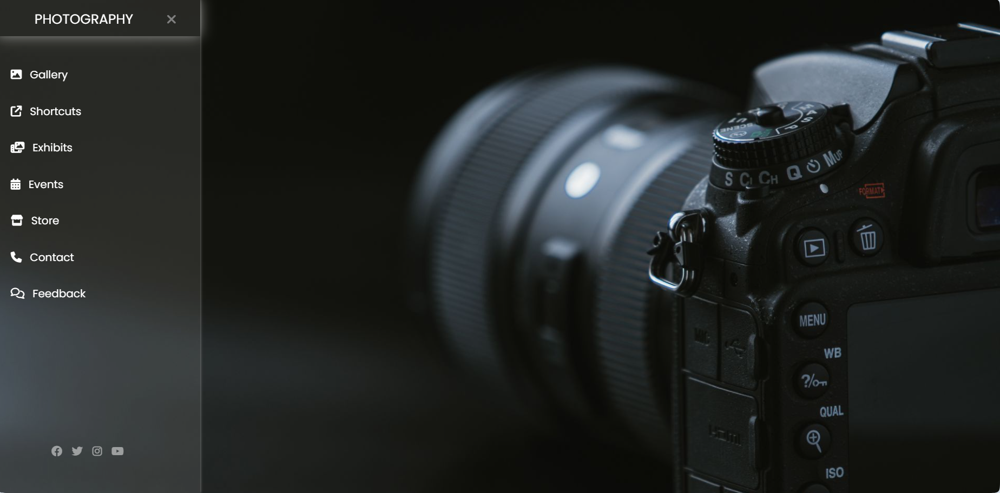

# Photography Website  
A visually appealing and interactive **Photography Website** built using **HTML, CSS, and JavaScript**.  
This project showcases a sleek and modern user interface with a **sidebar navigation menu**, providing users easy access to various sections such as **Gallery, Exhibits, Events**, and more.  

# Features  
- **Gallery** – A beautifully designed photo gallery to display stunning images.  
- **Shortcuts** – Quick access to essential website sections.  
- **Exhibits** – Highlights of photography exhibits and showcases.  
- **Events** – Information about upcoming photography-related events.  
- **Store** – A section dedicated to photography-related products or prints.  
- **Contact** – Easy-to-access contact information for inquiries.  
- **Feedback** – Users can share their feedback and experiences.  
- **Dark Theme** – A modern and elegant dark-themed UI.  

# Technologies Used  
- **HTML5** – Structuring the website content.  
- **CSS3** – Styling and designing a smooth user interface.  
- **JavaScript** – Adding interactivity and enhancing user experience.

# Preview

